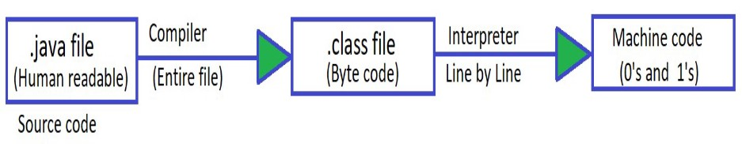
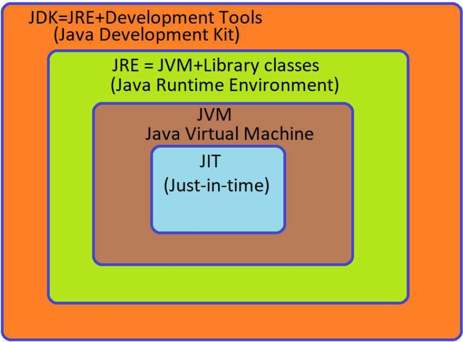
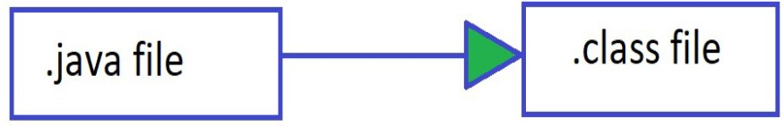
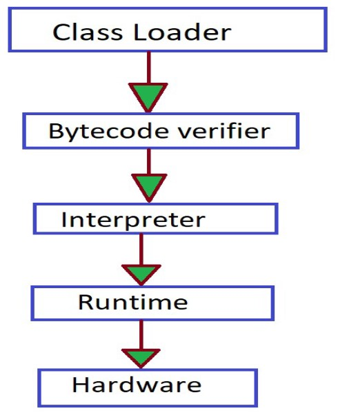

<h1 align="center"> *INTRODUCTION TO JAVA* </h1>

## Introduction to Java

### Ques – Why do we use Programming language?
> Ans –Machine only understand 0’s and 1’s, for humans it is very
difficult to instruct computer in 0’s and 1’s so to avoid this issue we
write our code in human readable language (Programming
language).

#### “ Java is one of the Programming Language”

>  The code written in java is human readable and it is saved using
extension .java  
 This code is known as source code  
### Java Compiler:-
>  Java compiler converts the source code into byte code which have the
extension .class  
 This byte code not directly run on system  
 We need JVM to run this  
 Reason why java is platform independent  
### Java Interpreter:-
>  Converts byte code to machine code i.e. 0’s and 1’s  
 It translate the byte code line by line to machine code  

## More About Platform Independent
> → It means that byte code can run on all operating system  
→ We need to convert source code to machine code so computer can  
understand it.  
→ Compiler helps in doing this by turning it into executable code.  
→ This executable code is a set of instruction s for the computer.  
→ After compiling C/C++ code we get .exe file which is platform dependent.  
→ In java we get byte code, JVM converts this to machine code.  
→ Java is platform independent but JVM is platform dependent.  

## Architecture of Java

## JDK
>  Provide Environment to develop and run the java program.
###  It is a package that includes :-
> 1. Development tools :- To provide an environment to run your
   program.
> 2. JRE :- To Execute your program.
> 3. A compiler :- javac
> 4. Archiver :- Jar
> 5. Docs generator :- Javadoc
> 6. Interpreter/loader

## JRE
> It is an installation package that provides environment to only run the
   program.
### It consist of :-
> 1. Deployment technology
> 2. User interface toolkit
> 3. Integration libraries
> 4. Base libraries
> 5. JVM :- Java virtual Machine

## Compile Time:-

>  After we get the .class file the next thing happen at runtime :
> 1. Class loader loads all classes needed to execute the program.
> 2. JVM sends code to bytecode verifier to check the format of code.

## Runtime :-

## (How JVM Works) class Loader
###  Loading
>→ Read .class file and generate binary data.  
→ an Object of this class is created in heap.  
###  Linking
>→ JVM verifies the .class file.  
→ allocates memory for class variables and default values.  
→ replace symbolic references from the type with direct reference.  
###  Initialization
>→ All static variables are assigned with their values defined in the code
and static bock.  
→ JVM contains the stack and heap memory locations.  

## JVM Execution
###  Interpreter
>→ Line by line execution  
→ When one method is called many times it will interpret again and
again
###  JIT
>→ Those methods that are repeated, JIT provides direct machine code so
that interpretation is not required.  
→ Makes execution Faster.  
→ Garbage collector.  

## Working of Java Architecture

## Tools required to run java on machine
> 1. JDK https://www.oracle.com/in/java/technologies/javase-downloads.html  
> 2. InteliJ  
   a) For windows :-  
   https://www.jetbrains.com/idea/download/#section=windows  
   b) For macOS :-  
   https://www.jetbrains.com/idea/download/#section=mac  
   c) For Linux :-  
   https://www.jetbrains.com/idea/download/#section=linux  