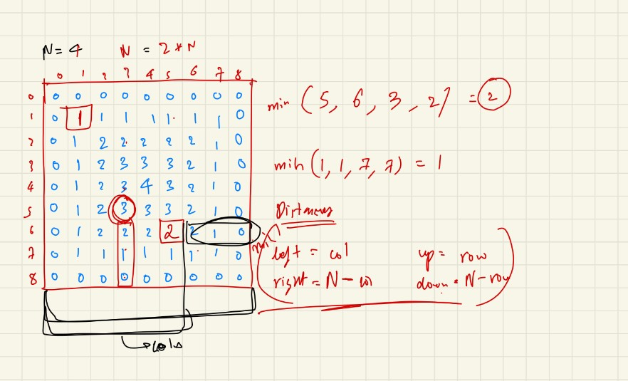

<h1 align="center"> *PATTERN* </h1>

## How to Approach Question

>1. No. of lines = No. of rows = No. of times outer loop will run.
>2. Identify for every row no. :-<br/>
    * How many column are there. <br/>
    * Types of Elements in col.
>3. What do you need to print

#### Note-
> Try to find the formula relating row and column.

Q1:-
```
*
* *
* * *
* * * *
```
> 4 rows,<br/>
> 1st row -> 1 col<br/>
> 2nd row -> 2 col<br/>
> 3rd row -> 3 col<br/>
> 4th row -> 4 col<br/>
> Hence inner loop will run acc. to row no.


Q2:-
```
*****
****
***
**
*
```

> Inner loop will run (No of total row - i).

Q2:-
