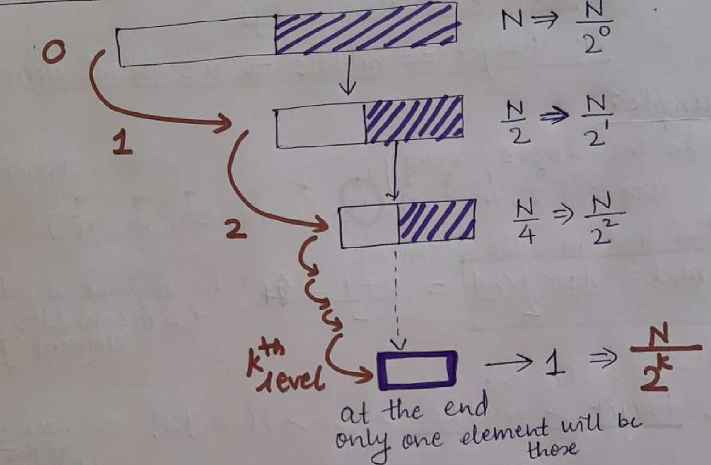
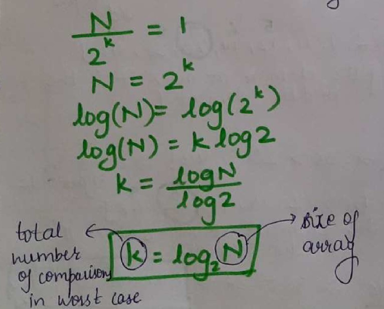
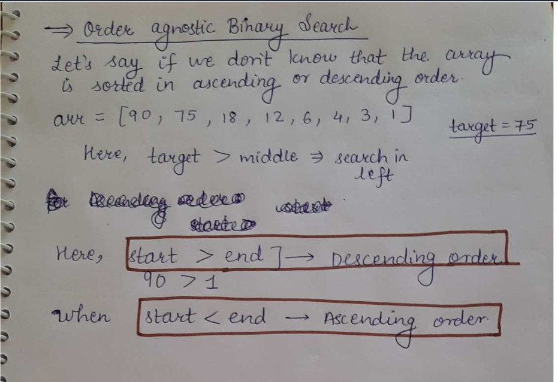
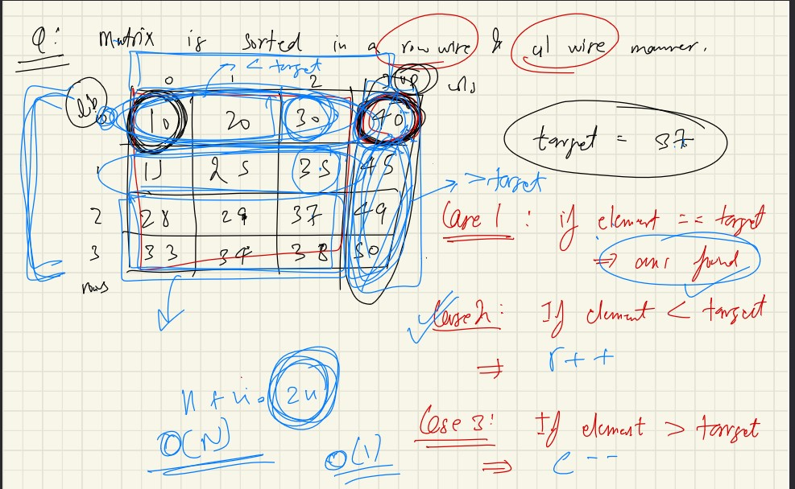
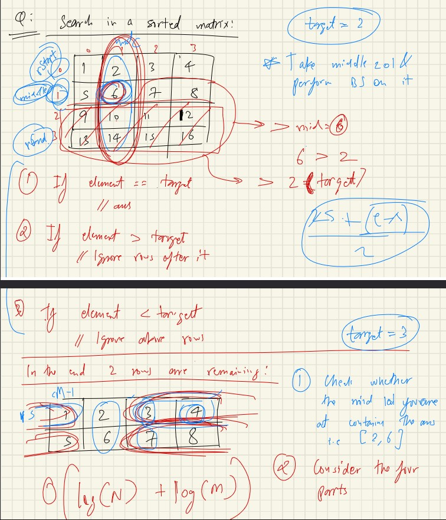

<h1 align="center"> *INTRODUCTION TO PROGRAMMING* </h1>

>1. find the middle element
>2. target > mid ⇒ search in the right else search in left
>3. if middle element == target element //ans

### Why Binary Search ?
>Ans: Find the max number of sub comparisons in worst case.

> In O(log(N) + log(M))
> log(N) is for no of row and log(M) is for no of col. 