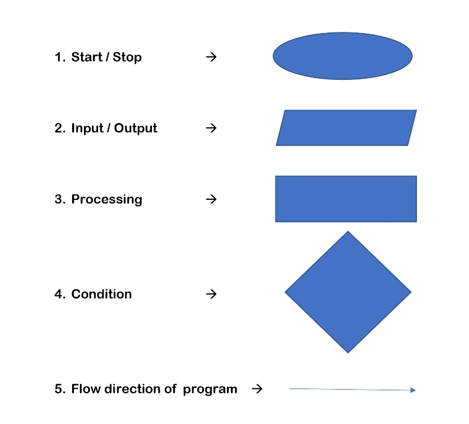
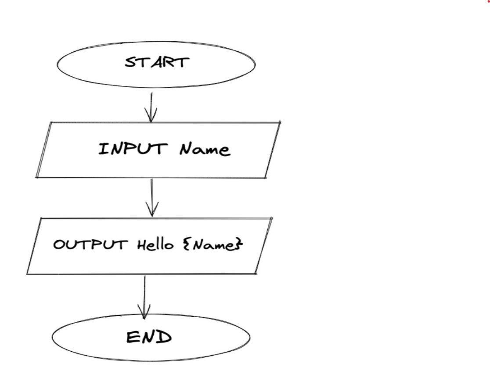
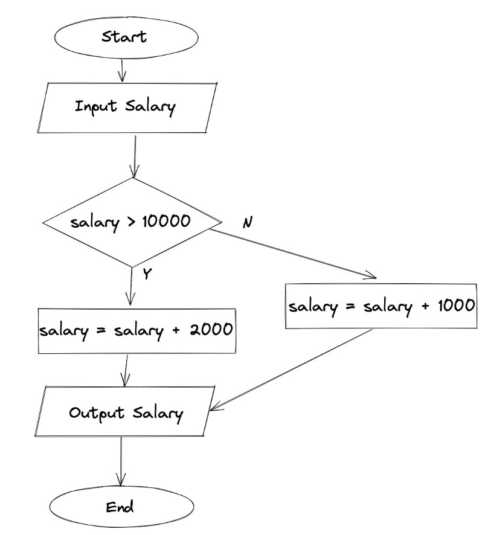
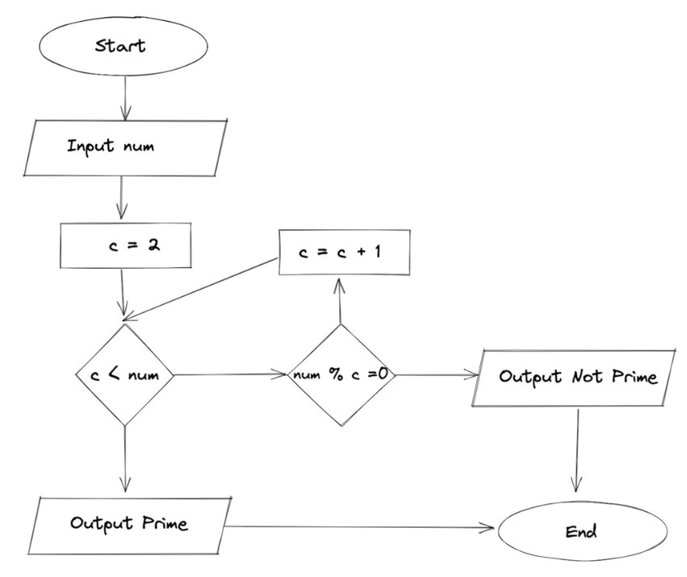
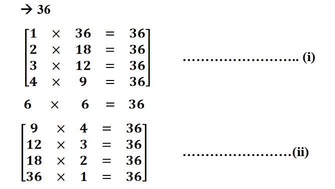

<h1 align="center"> *FLOW OF THE PROGRAM* </h1>

## Flow Chart :- 
> Visualization of our thought process or Algorithm and represent them diagrammatically is called flow chart
### Symbols to Be used in flow chart:


### Start / Stop: - 
>An ovel shape indicate the starting and ending points of the
flow chart.
### Input / Output: - 
>A parallelogram is used to represent Input and output in
flow chart
### Processing: - 
>A rectangle is used to represent process such as mathematical
computation or variable assignment.
### Condition: - 
>A diamond shape is used to represent conditional statement
which results in true or false (Yes or No).
### Flow direction of program: - 
>An arrow shape is used to represent flow of
the program.

### Example 1 :- 
> Take a name and output Hello name.


### Example 2 :- 
> Take input of a salary. If the salary is greater than
10,000 add bonus 2000, otherwise add bonus as 1000.
> 

### Example 3 :- 
> Input a number and print whether it is prime or not.


## Pseudocode :- 
> It is like a rough code which represents how the algorithm
of a program works.
 Pseudocode does not require syntax.
### Pseudocode of Example 2
```flow
Start
Input Salary
if Salary > 10000 :
Salary = Salary+2000
else :
Salary = Salary+1000
Output Salary
exit
```

### Pseudocode of Example 3
```flow
Start
Input num
if num ≤ 1
print “Nither prime nor composite”
c = 2
while c < num
if num % c = 0
Output “Not Prime”
Exit
c = c+1
end while
Output “Prime”
Exit.
```

## Optimization of prime solution
> Let’s have a number to check it’s a prime number of not

>In the above demonstration we have clearly seen that (i) and (ii) are
repeated so, to optimize this we can ignore the (ii)
#### As same as this
> We can check the number is prime or not by travelling form
𝟐 𝒕𝒐 √𝒏𝒖𝒎𝒃𝒆𝒓 <br/>
#### For example:-
>  To check 23456786543 is prime or not, we only have to travel from
𝟐 𝒕𝒐 √𝟐𝟑𝟒𝟓𝟔𝟕𝟖𝟔𝟓𝟒𝟑 (i.e. 153156) <br/>
>  To check 17 is prime or not, we do not have to travel from 2 to 17 we
just have to travel from 𝟐 𝒕𝒐 √𝟏𝟕 (i.e. 4)

### Optimized Pseudocode of Example 3
```flow
start
input n
if n<=1:
      print("neither prime nor composite);
      c=2
      while c*c <=n:
            if n%c == 0;
               output "not prime"
               exit
            c +=1
      end while
      output "prime"
exit
```