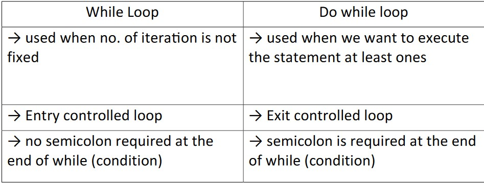

<h1 align="center"> *Conditional and loops* </h1>


## Condition:- 
It provides check for the statement. <br/>

 1. If-else statement → Used to check the condition, it checks the
   Boolean condition True or False.
#### Syntax :-
``` java
   if (boolean expression True or false){
   //Body
   } else{
   // Do this
   }
   Example:-
   public class IfElse {
   public static void main(String[] args) {
   int salary = 25400;
   if (salary> 10000) {
   salary = salary + 2000;
   }
   else {
   salary = salary + 1000;
   }
   System.out.println(salary);
   }
   }
```
>   Output :- 27400


2. Multiple if-else statement<br/>
  → It executes one condiƟon from mulƟple statements.
####  Syntax :-

>   if (condition 1){<br/>
   // code to be executed if condition 1 is true<br/>
   } else if (condition 2) {<br/>
   // code to be executed if condition 2 is true<br/>
   } else if (condition 3){<br/>
   // code to be executed if condition 3 is true<br/>
   } else{<br/>
        // code to be executed if all conditions are false<br/>
   }

Example :-
``` java
   public class MultipleIfElse {
       public static void main(String[] args) {
           int salary = 25400;
           if (salary <= 10000) {
               salary += 1000;
           } else if (salary <= 20000) {
               salary += 2000;
           } else {
               salary += 3000;
           }
           System.out.println(salary);
       }
   }
```
   Output :- 28400


## Loop → 
> Loops are used to iterate a part of program several times.
1. for loop :- 
> It is generally used when we know how many times
  loop will iterate.<br/>

  Syntax :-

>  for (initialization; condition; increment/decrement){<br/>
  // body<br/>
  }

  Example 1:- print numbers from 1 to 5

```java   
public class forloop {
  public static void main(String[] args) {
  for (int num=1;num<=5;num+=1){
  System.out.println(num);
  }
  }
  }
  ```
 > Output :- 1<br/>
  2<br/>
  3<br/>
  4<br/>
  5<br/>
 
  Example 2 :- print numbers from 1 to n
 ```java 
  import java.util.Scanner;
  public class forloop {
  public static void main(String[] args) {
  Scanner in = new Scanner(System.in);
  int n = in.nextInt();
  for (int num=1;num<=n;num+=1){
  System.out.print(num + " ");
  }
  }
  }
 ```
 > Input : 6<br/>
  Output :- 1 2 3 4 5 6


2. While Loop :- 
>It is used when we don’t know how many times the loop will iterate.
> 
   Syntax :-

>  while (condition){<br/>
   // code to be executed<br/>
   // increment/decrement<br/>
   }<br/>

   Example :-
 
```java 
   public class whileloop {
   public static void main(String[] args) {
   int num = 1;
   while (num <=5){
   System.out.println(num);
   num += 1;
   }
   }
   }
```

>   Output :- 1<br/>
   2<br/>
   3<br/>
   4<br/>
   5<br/>


3. do while loop :- 
>It is used when we want to execute our statement at least one time.

> → It is called exit control loop because it checks the condition
   after execution of statement.

   Syntax :-

> do{<br/>
   // code to be executed<br/>
   // update statement -> increment/decrement<br/>
   }while (condition);<br/>

   Example :-
```java 
   public class doWhileloop {
   public static void main(String[] args) {
   int n = 1;
   do{
   System.out.println(n);
   n++;
   } while(n<=5);
   }
   }
```
>  Output :- 1<br/>
   2<br/>
   3<br/>
   4<br/>
   5<br/>


