<h1 align="center"> *ARRAYS IN JAVA* </h1>

An array is a collection of similar data type values.  
Syntax: datatype[] variable_name = new datatype[size];  

              OR

datatype[] variable_name; 
variable_name = new datatype[size]; 

              OR

datatype[] variable_name = {value1, value2, value3, . . ., valueN}; 

## Understanding the Syntax:

datatype[] variable_name; 

>This step will initialize the variable, and it will get initialized in the stack during compile time. 

Example: int[] number; 

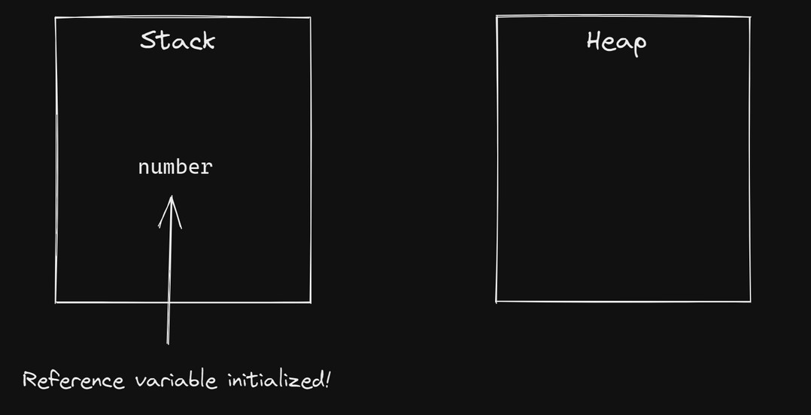

variable_name = new datatype[size];

>In this step, aa new object will be created in the heap memory during runtime. 
The 'new' keyword is used to create a new object.

Example: n=new int[6];

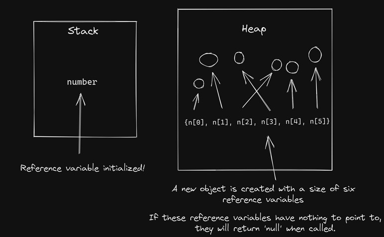

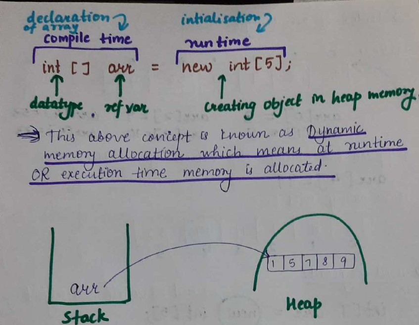

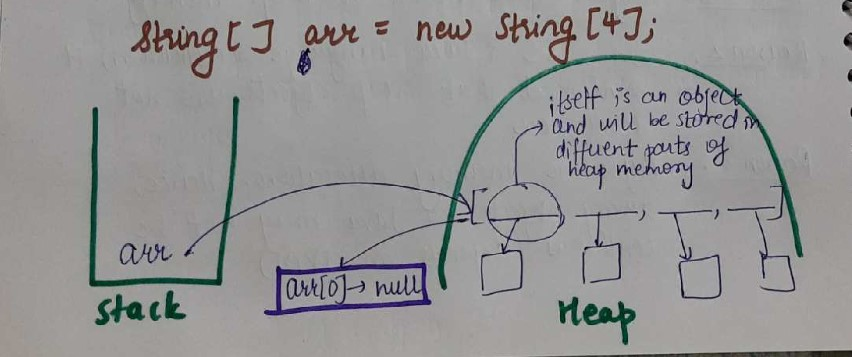
### Note

>1. Heap is the runtime data area from which the memory for all the classes instances is allocated. 
>2. Arrays in C and C++ use contiguous memory allocation in order that pointer arithmetic can be used to access the various elements. 
>3. Even though definition of Arrays says (It's continuous) still in Java internally it may not be continuous. -- It depends on JVM. 
>4. By default, value in arrays : int -> 0, String -> "null". 
>5. "null" is a special type of literal of a null type. 
>6. By Default value of object is "null". 
>7. Primitives are stored in stack memory and objects in heap. 
>8. How reference variables are passed into function? Ans:- In java only "Call by value". 
>9. When we pass object reference, in actually going to take copy of that reference which is going to point to the same object. 
>10. Strings are immutable in java but Arrays are mutable in java. 
>11. Mutable means you can change the object. 
>12. Array objects are in heap. 
>13. Heap objects are not continuous. 
>14. It may be Dynamic memory allocation(DMA). 
>15. Hence:- may not be continuous ---> Depends on JVM. 
>16. Primitives (int, char, etc.) are stored in stack. 
>17. All other objects are stored in heap memory. 
>18. Arrays.toString(array) ---> internally uses for loop and gives the output in proper format. 
>19. In an array, since we can change the objects, hence they are mutable. 

## 2D Arrays:

A 2D array can be visualized as a matrix. Let's understand how?

> First of all, let's take a 1D array like this, 
>   int[] num = {2, 5, 6, 9, 3}; 

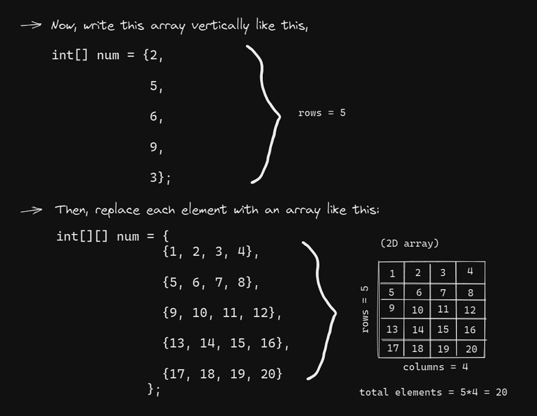

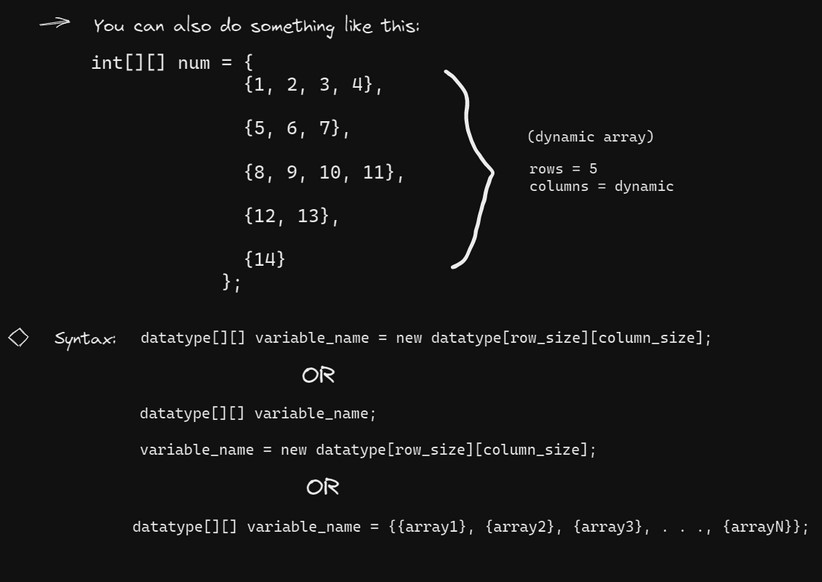

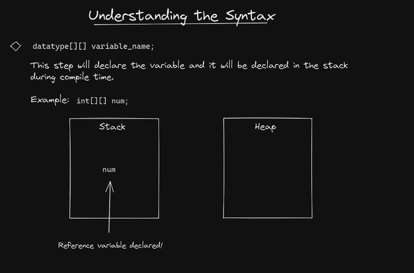

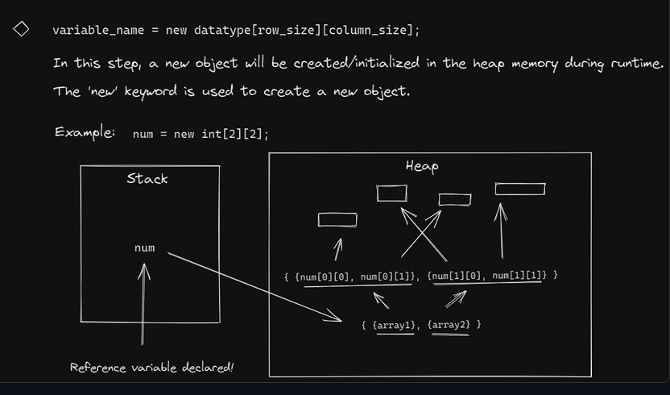

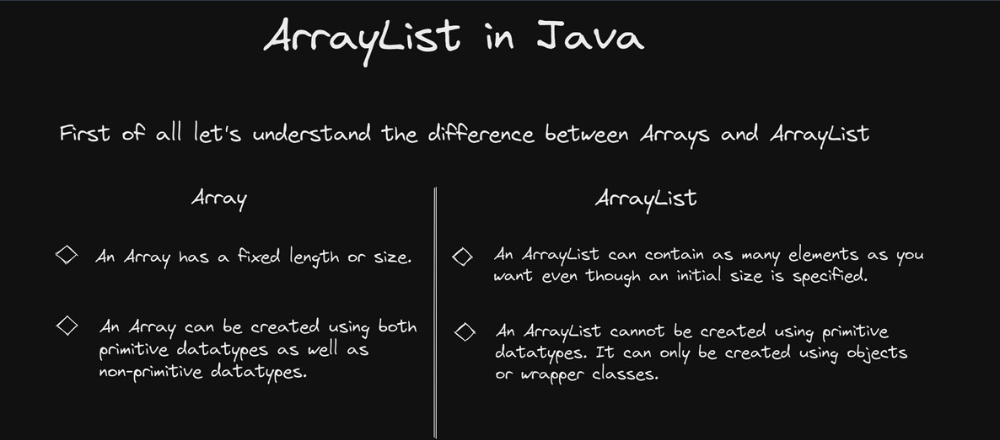

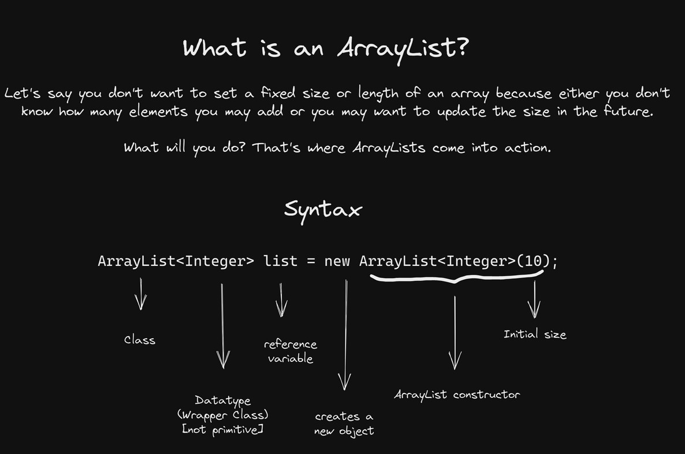

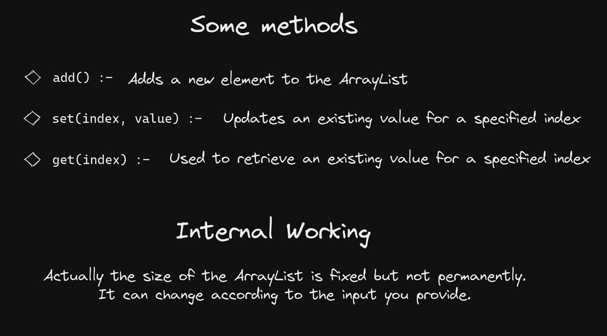

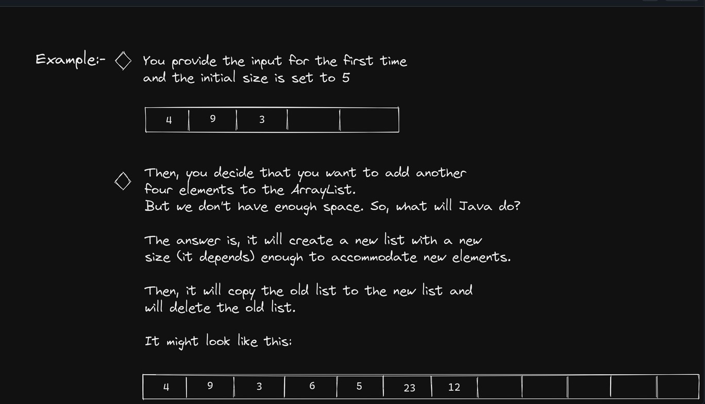

  