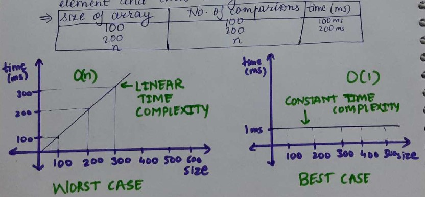

<h1 align="center"> *Linear search* </h1>

## Searching:
> It is a process of finding a given value position in a list of value.

### Linear/Sequential Search:
> It is basic and simple search algorithm.
> In sequential search, we compare the target value with all the other elements given in the list.

> eg: arr = [18, 12, 19, 77, 29, 50]  (unsorted array) 
>            0,  1,  2,  3,  4,  5  -- index 
>     target=77 
In above example, the target value is compared with all the elements in array in sequential/linear way.

## Time Complexity:

-> Best case: O(1)  --> constant
> How many checks will the loop make in best case i.e; the element will be found at 0th index i.e; only one comparison will 
> be made for best case.

-> Worst Case: O(n) 
> Worst case, here it will go through every element and, then it says element not found.

